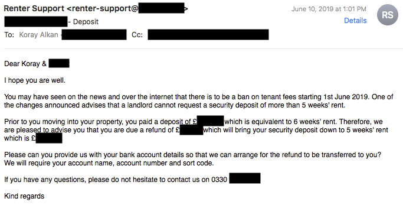
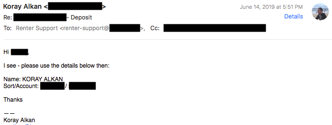
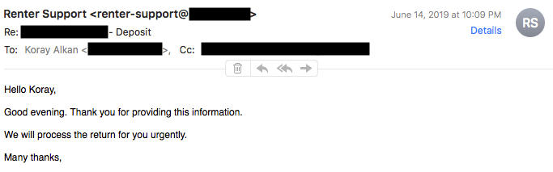
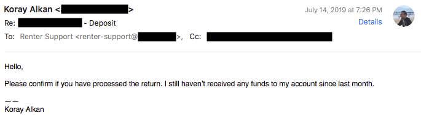
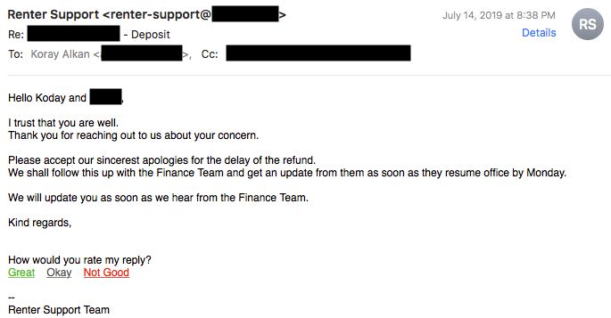
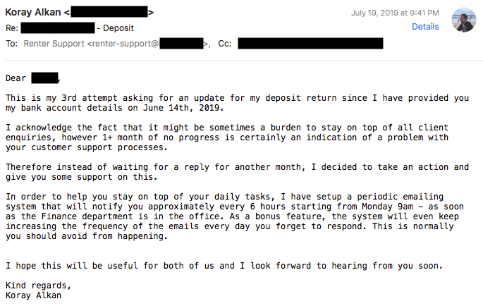
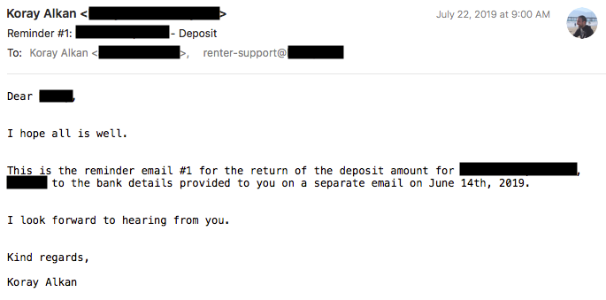

This is not a tutorial on Heroku or Python. Instead, it's a story of how software can be used for fun, escalations and getting results. All at once.

> It's a _Python_ app that takes an HTTP request to kick-off email reminders every 6 hours and the interval drops down to every minute after 24 hours, until it's stopped.

It starts with my rental agency and a recent change of UK regulations on [deposit caps](https://www.tenancydepositscheme.com/learn-more/information-tds-lounge/guides/depositcap/) for rentals. My rental agency, which I will call them "Housy", sends me an email to refund partial amount of my holding deposit. It's a small amount but it's some extra money into my bank acount, so good news. This is what I receive on June 10th:

I reply back on June 14th with my account details after realizing they don't actually have my bank account details although there's a direct debit set. I find this interesting but continue:

So far so good – I expect them to return back the small sum in a day or two although it should take seconds to do a transfer nowadays. And I receive the following in a few hours on June 14th, very reassuring:

And I wait.

I wait for a month.

They send back a reply pretty quickly although I'm sure my name is not Koday. Also I admit getting a reply at 8:30pm is impressive – do they work 24/7?

July 18th, 4 days later, still nothing. I send another reminder to them and they tell me the exact same thing – that they will look into this as soon as possible.

## Final "human" email

It's obvious – I need to keep chasing them to complete the transaction. It's also ironic that if I were to owe them any amounts I'm pretty sure they would keep harrassing me every single day. **_However I have more important things to do than to keep sending reminder emails_**. So the answer: automate it.

**July 19th, 2019 Friday**

I'm back from work, don't have any plans for tonight other than relaxing after a busy week. I have dinner and sit in front of my computer to hack a [Heroku](https://www.heroku.com/) app very quick – takes an hour to do so. By 9:41pm it's ready to go live after some tests and **_I send my final "human" email to them:_**

That's it.

It's a _Python_ app that takes an HTTP request to kick-off email reminders every 6 hours and the interval drops down to every minute after 24 hours, until it's stopped.

App is scheduled to start the process on July 22nd, 9am sharp.

And it does:

## Conclusion

System turned out to be sending 2 notifications until I was able to see the funds in my account by the end of the day. If I consider the amount of time I spent writing the application I don't think it justifies the effort, neverthless I ended up getting my money back in a few hours, practicing my Python and Heroku skills, and more importantly having fun on a Friday evening at home. At least I have the infrastructure now if I face with a similar issue in the future – though I hope I don't have to use it again!
